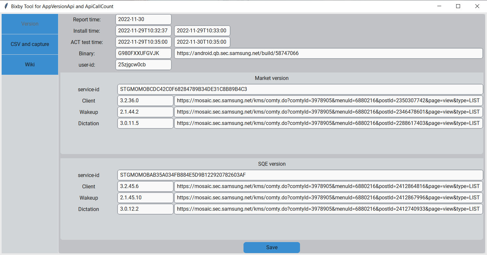
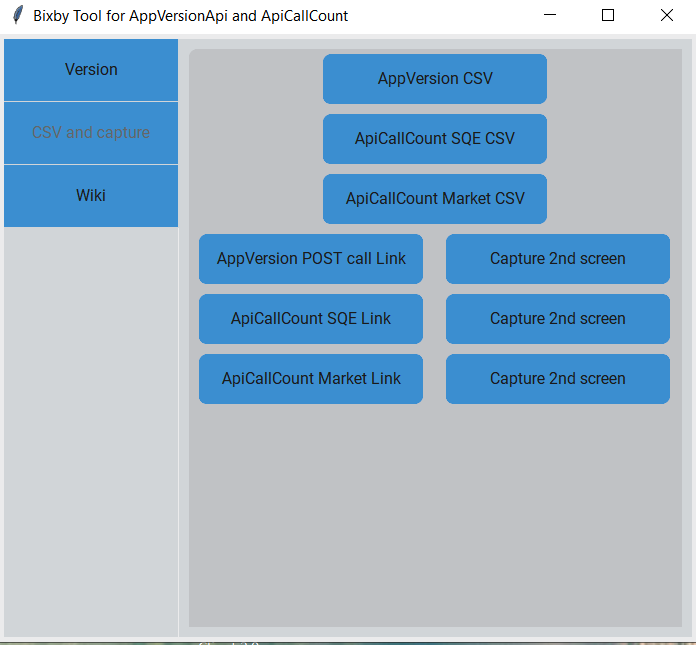
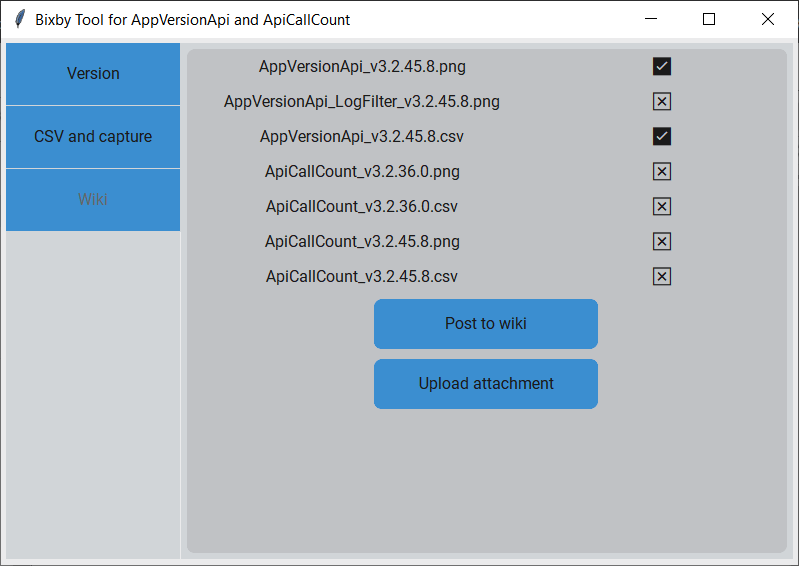

# Bixby-Sumologic-Test
Test AppVersion POST call, API call count

## Install: Run install.bat

## Run:
Run mainUI.py

## Guide:
1. Version screen

Fill in the boxes, press "Save" button

2. CSV and capture screen

Get csv: press CSV buttons, wait until popup appear, csv file is saved.
Open links: you drag EDGE to external screen manually and  press capture. You need to press extract button to capture with extract name.

3. Wiki post screen

Press "Post to wiki" first to make a page on wiki then "Upload attachment" to this link
Follow log to get link