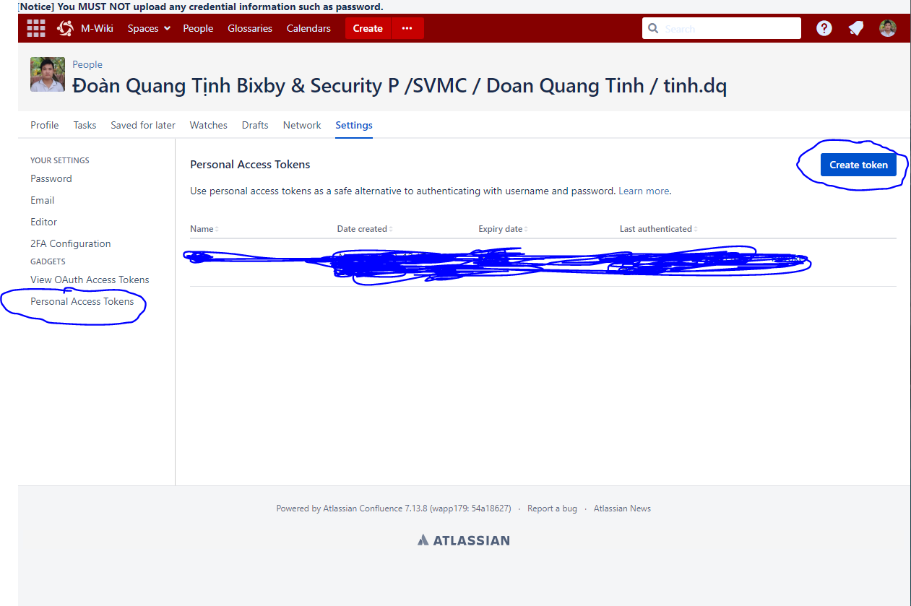
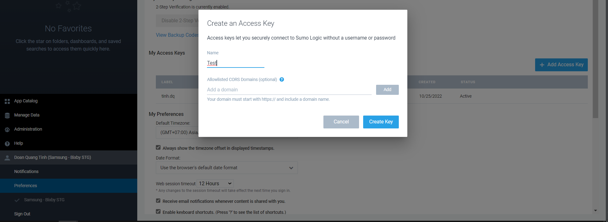

# Authenticate:
## 1. Get Token Wiki:

```
headers = {
    "Authorization": f'Bearer {token}',
    "X-Atlassian-Token": "no-check"
}
```


## 2. Get AccessID and AccessKey SUMOLOGIC:
Account -> Preferences -> Add Access Key



```
# basicAuth = base64.b64encode("{AccessID}:{AccessKey}".encode('ascii')).decode("ascii")
headers = {'Authorization': f'Basic {basicAuth}'}
```
